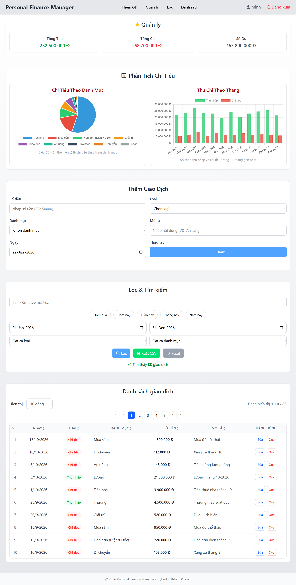

# 💰 Personal Finance Manager

> Modern web application for personal financial management with real-time tracking, advanced filtering, and data visualization.

   

**🌐 Live Demo:** [https://personalfinance.lovestoblog.com/](https://personalfinance.lovestoblog.com/)  
**Demo Accounts:** `admin`/`123456` or `minh`/`141103`

---

## 📸 Screenshots



---

## ✨ Key Features

### 🔐 Security

- ✅ Bcrypt password hashing + Session timeout
- ✅ SQL injection prevention (PDO prepared statements)
- ✅ XSS protection + Input validation
- ✅ User data isolation (transactions filtered by user_id)

### 💳 Transaction Management

- ✅ CRUD with AJAX (no page reload)
- ✅ Smart category auto-filtering by type
- ✅ Real-time validation (frontend + backend)
- ✅ Date management (defaults to today, blocks future dates)

### 🔍 Advanced Filtering

- ✅ Multi-criteria: Type, Category, Date Range, Keyword
- ✅ Debounced search (500ms delay)
- ✅ Quick filters: Today, This Week, This Month
- ✅ Column sorting (Date, Amount, Category, Description)

### 📊 Visualization

- ✅ Chart.js integration (Pie Chart + Bar Chart)
- ✅ Real-time updates after CRUD operations
- ✅ Responsive design for all screen sizes

### 📱 Responsive Design

- ✅ Mobile-first approach
- ✅ 6 breakpoints (360px → 1400px)
- ✅ Toggle form on small screens (< 1000px)
- ✅ Sticky sidebar on desktop

### 🎯 Other Features

- ✅ Server-side pagination (10/25/50/100 rows)
- ✅ CSV export with summary
- ✅ Excel-compatible UTF-8 encoding
- ✅ Loading states + notifications

---

## 🛠 Tech Stack

**Backend:** PHP 8.0+, MySQL 5.7+, PDO, bcrypt  
**Frontend:** HTML5, CSS3 (Grid/Flexbox), Vanilla JavaScript ES6+  
**Libraries:** Chart.js 4.4.0  
**Hosting:** InfinityFree (Free)

**Architecture:**

- 9 CSS modules (modular styling)
- 14 JS modules + 1 app entry (modular logic)
- 7 API endpoints (RESTful)
- 3 SQL migrations (schema + data)

---

## 📁 Project Structure

```
personal-finance-manager/
├── 📁 api/                      # RESTful API endpoints (7 files)
│   ├── analytics/summary.php    # Chart data
│   ├── categories/list.php      # Category management
│   └── transactions/            # CRUD operations
│       ├── delete.php, export.php, filter.php
│       ├── save.php, update.php
├── 📁 assets/
│   ├── css/modules/             # 9 CSS modules + manifest
│   ├── images/demo/             # Screenshots
│   └── js/modules/              # 14 JS modules + app.js
│       ├── filter/              # 5-file filter system
│       └── chart-handler.js, form-handler.js, etc.
├── 📁 auth/                     # Authentication (4 files)
│   ├── check-auth.php, login-process.php
│   ├── logout.php, register-process.php
├── 📁 config/
│   └── database.php             # DB connection
├── 📁 includes/
│   ├── footer.php, header.php, helpers.php
├── 📁 migrations/               # 3 SQL files
│   ├── 001_init.sql, 002_update_password_hash.sql
│   └── 003.sql                  # 100 sample transactions
├── .htaccess                    # Security headers
├── index.php, login.php, register.php
└── README.md
```

---

## 🚀 Installation

### Prerequisites

- XAMPP/Laragon (PHP 8.0+, MySQL 5.7+)
- Modern browser

### Quick Start

```bash
# 1. Clone repository
git clone https://github.com/tcminh1411/personal-finance-manager.git

# 2. Move to htdocs
mv personal-finance-manager /path/to/xampp/htdocs/

# 3. Create database in phpMyAdmin
# - Database name: finance_db
# - Collation: utf8mb4_unicode_ci

# 4. Import SQL files (in order)
migrations/001_init.sql
migrations/002_update_password_hash.sql
migrations/003.sql

# 5. Configure database (if needed)
# Edit config/database.php

# 6. Access application
# http://localhost/personal-finance-manager

# 7. Login with demo account
# Username: admin / Password: 123456
```

### File Permissions (Linux/Mac)

```bash
chmod 644 *.php
chmod 755 assets/ api/ auth/ config/ includes/ migrations/
chmod 600 config/database.php
```

---

## 📖 Quick Usage Guide

**Add Transaction:** Fill form → Select type → Choose category → Enter amount/description → Submit

**Filter Data:** Use search box / Select type & category / Pick date range / Click "Lọc"

**Sort:** Click column headers (↕ symbol)

**Edit:** Click "Sửa" button → Modify → Update

**Delete:** Click "Xóa" → Confirm

**Export CSV:** Apply filters (optional) → Click "Xuất CSV"

**View Charts:** Scroll down to "Phân Tích Chi Tiêu" section

---

## 📊 Project Stats

| Metric                | Value                     |
| --------------------- | ------------------------- |
| **Total Files**       | 49 (code + assets)        |
| **Lines of Code**     | ~8,500+                   |
| **PHP Files**         | 18 (API + Auth + Pages)   |
| **JavaScript Files**  | 15 (14 modules + app)     |
| **CSS Files**         | 10 (9 modules + manifest) |
| **SQL Migrations**    | 3 (schema + data)         |
| **Development Time**  | 7 weeks                   |
| **Features**          | 40+                       |
| **Breakpoints**       | 6 responsive breakpoints  |
| **Demo Transactions** | 100 (user: minh)          |

---

## 🎯 Development Timeline

**Week 1-2:** Database design, Basic CRUD, HTML/CSS foundation  
**Week 3-4:** AJAX integration, Advanced filtering, Pagination, CSV export  
**Week 5-6:** Authentication, Chart.js, Responsive design, UX polish  
**Week 7:** Security audit, Documentation, Deployment to InfinityFree

---

## 🤝 AI Collaboration

This project was developed with **Claude AI (Anthropic)** as a coding companion:

**AI Contributions (~60% code volume):**

- Security implementation (session, validation, auth)
- Modular architecture (15 JS files, 10 CSS files)
- Responsive design system (6 breakpoints)
- Database optimization (indexes, queries)
- Documentation (README, comments)

**Human Contributions (~40% decision-making):**

- Project vision and requirements
- UX design and workflow
- Feature prioritization
- Testing and validation
- Final integration and deployment

This demonstrates effective **human-AI collaboration** in modern development - using AI to accelerate implementation while maintaining creative control and code ownership.

---

## 🐛 Known Issues & Roadmap

**Current Limitations:**

- Charts require modern browser (no IE11 support)
- Free hosting may have occasional downtime

**Planned Enhancements:**

- Budget planning and goals
- Recurring transactions
- Multi-currency support
- Mobile app (React Native)
- Two-factor authentication
- PDF reports
- Bank statement import

---

## 📄 License

MIT License - Copyright (c) 2026 Thái Cao Minh

Free to use, modify, and distribute. See [LICENSE](LICENSE) file for details.

---

## 📞 Contact

**Developer:** Thái Cao Minh  
**Email:** [tcminh1411@gmail.com](mailto:tcminh1411@gmail.com)  
**GitHub:** [github.com/tcminh1411](https://github.com/tcminh1411)  
**Live Demo:** [personalfinance.lovestoblog.com](https://personalfinance.lovestoblog.com/)

**Found a bug?** [Create an issue](https://github.com/tcminh1411/personal-finance-manager/issues)  
**Security issue?** Email directly (do not post publicly)

---

## 🙏 Acknowledgments

**Technology:** PHP Community • Chart.js Team • InfinityFree • OWASP  
**Learning:** MDN Web Docs • Stack Overflow • freeCodeCamp  
**AI Partner:** Anthropic Claude (coding companion throughout development)

---

<div align="center">

**⭐ Star this repo if you find it helpful!**

**Made with ❤️ and ☕ (and AI assistance)**

[🌐 Live Demo](https://personalfinance.lovestoblog.com/) • [📂 GitHub](https://github.com/tcminh1411/personal-finance-manager) • [📧 Contact](mailto:tcminh1411@gmail.com)

---

**Last Updated:** January 2026 | **Version:** 1.3.0 | **Status:** ✅ Production Ready

</div>
